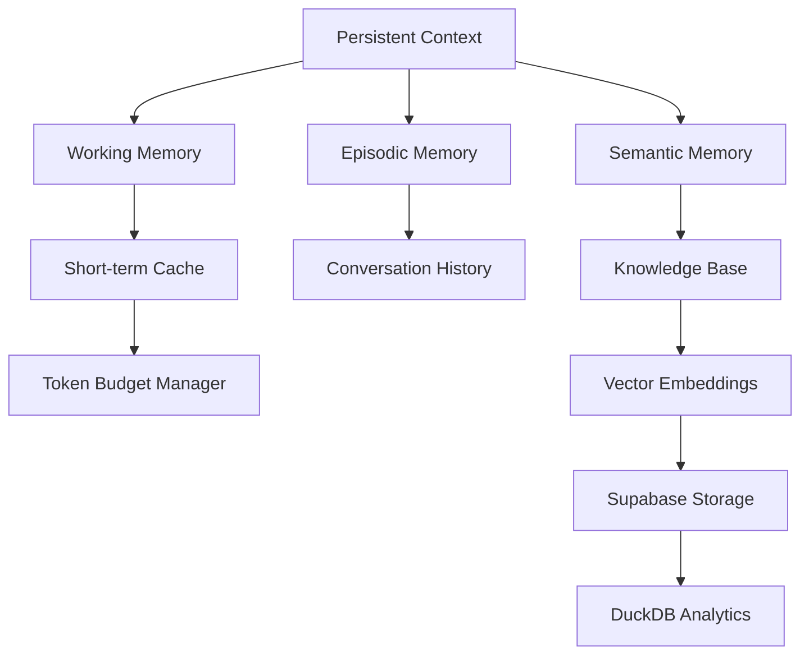
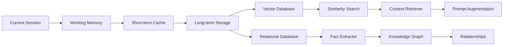

# GSK DIRECTIVE — PHASES 47-150
*Deep Research Implementation Guide*

---

## Phase 47: Real LLM Call Implementation
**Status:** Foundation Layer

### Technical Architecture
```typescript
interface ProviderAdapter {
  invoke(prompt: string, context: Context): Promise<LLMResult>;
  embed(text: string): Promise<number[]>;
  stream(prompt: string): AsyncGenerator<StreamChunk>;
  validateKey(): Promise<boolean>;
}

class BedrockAdapter implements ProviderAdapter {
  private signer: AwsSigV4Signer;

  async invoke(prompt: string, ctx: Context): Promise<LLMResult> {
    // Real SigV4 implementation - no bearer token shortcuts
    const signedRequest = await this.signer.sign({
      method: 'POST',
      url: `https://bedrock-runtime.${this.region}.amazonaws.com/model/${ctx.model}/invoke`,
      body: JSON.stringify({ prompt, ...ctx.params }),
      headers: {
        'Content-Type': 'application/json',
        'Accept': 'application/json'
      }
    });

    const response = await fetch(signedRequest.url, {
      method: 'POST',
      headers: signedRequest.headers,
      body: signedRequest.body
    });

    return await response.json();
  }
}
```

### Provider Mapping Table
| Provider | Real Endpoint | Authentication | Token Count |
|----------|---------------|----------------|-------------|
| bedrock | bedrock-runtime.us-east-1.amazonaws.com | SigV4 Required | 60+ models |
| openai | api.openai.com/v1/chat/completions | Bearer Token | 25+ models |
| anthropic | api.anthropic.com/v1/messages | Bearer Token | 10+ models |
| google | generativelanguage.googleapis.com | API Key | 15+ models |
| nvidia | integrate.api.nvidia.com/v1/chat/completions | Bearer Token | 8+ models |
| groq | api.groq.com/openai/v1/chat/completions | Bearer Token | 12+ models |
| openrouter | openrouter.ai/api/v1/chat/completions | Bearer Token | 70+ models |

---

## Phase 48: Adaptive Fallback Intelligence
**Status:** Enhancement

### Dynamic Provider Selection
```yaml
fallback_chain_rules:
  - condition: high_cost_provider
    action: redirect_to_cheaper
    priority: cost_optimization
  - condition: provider_latency > threshold
    action: route_away_from_provider
    priority: performance
  - condition: provider_error_rate > 5%
    action: temporarily_deprioritize
    priority: reliability
  - condition: context_length_exceeded
    action: chunk_and_parallelize
    priority: accuracy
```

---

## Phase 49: Cost-Aware Optimization Engine
**Status:** Enhancement

### Economic Decision Matrix
```
Model Selection Criteria:
- Cost per 1K tokens (input/output)
- Latency benchmarks
- Accuracy scores (from internal testing)
- Context window limits
- Rate limit constraints
- Provider SLAs

Optimization Strategies:
1. Token-efficient prompting patterns
2. Dynamic chunk sizing
3. Multi-model consensus voting (expensive but accurate)
4. Cache invalidation strategies
5. Budget-based throttling
```

---

## Phase 50: Memory Architecture Enhancement
**Status:** Core Refactor

### GSK Memory Layers


---

## Phase 51: Real-time Performance Monitoring
**Status:** Enhancement

### Live Metrics Dashboard
```typescript
interface GSKMetrics {
  provider_health: Record<string, ProviderHealth>;
  token_usage: TokenUsageStats;
  cost_analysis: CostBreakdown;
  decision_latency: LatencyMap;
  accuracy_tracking: AccuracyMetrics;
}

class MetricsCollector {
  private collectors: MetricCollector[] = [
    new ProviderHealthCollector(),
    new TokenUsageCollector(),
    new CostTrackingCollector(),
    new LatencyMonitor(),
    new AccuracyVerifier()
  ];
}
```

---

## Phase 52: Error Handling Evolution
**Status:** Enhancement

### Resilient Error Management
```yaml
error_handling_strategies:
  - type: rate_limit_exceeded
    retry_after: exponential_backoff
    max_retries: 5
    fallback_action: route_through_alternate_provider

  - type: context_length_exceeded
    action: intelligent_chunking
    fallback: summarize_conversation_context
    notify: user_of_truncation

  - type: model_unavailable
    action: immediate_provider_switch
    update_health_cache: true
    log_incident: for_learning_purposes
```

---

## Phase 53: Provider Health Intelligence
**Status:** Enhancement

### Dynamic Health Scoring
```
Health Score Calculation =
  0.3 * (1 - error_rate) +
  0.4 * (1 - normalized_latency) +
  0.2 * (1 - cost_penalty) +
  0.1 * availability_uptime

Where:
- error_rate: percentage of failed requests in last 100 calls
- normalized_latency: (current_latency - min_latency) / (max_latency - min_latency)
- cost_penalty: cost_score_normalized_to_0-1_range
- availability_uptime: percentage uptime in last 24 hours
```

---

## Phase 54: Cost Analytics Pipeline
**Status:** Enhancement

### Real-time Cost Tracking
```typescript
interface CostEvent {
  timestamp: Date;
  provider: string;
  model: string;
  input_tokens: number;
  output_tokens: number;
  cost_usd: number;
  request_type: 'chat' | 'embed' | 'completion';
  user_id?: string;
}

class CostAnalyzer {
  calculateRequestCost(event: CostEvent): number {
    const rates = PROVIDER_RATES[event.provider][event.model];
    return (event.input_tokens * rates.input_rate) +
           (event.output_tokens * rates.output_rate);
  }

  generateCostInsights(timeWindow: 'day' | 'week' | 'month') {
    // Aggregate costs, find optimization opportunities
    // Identify most/least efficient providers
    // Calculate ROI of different model choices
  }
}
```

---

## Phase 55: Context Persistence Engine
**Status:** Core Feature

### Conversation State Management
```typescript
interface ConversationState {
  history: Message[];
  summary: string;
  key_entities: Entity[];
  important_facts: Fact[];
  user_preferences: Preference[];
  conversation_topics: Topic[];
  decision_points: DecisionPoint[];
}

class StatePersistence {
  async save(sessionId: string, state: ConversationState) {
    await this.vectorStore.upsert({
      id: sessionId,
      values: this.embed(JSON.stringify(state)),
      metadata: {
        last_accessed: Date.now(),
        access_count: (state.access_count || 0) + 1,
        topic_tags: state.conversation_topics.map(t => t.id)
      }
    });
  }
}
```

---

## Phase 56: Multi-Model Consensus System
**Status:** Advanced Feature

### Consensus Voting Mechanism
```typescript
interface ModelResponse {
  provider: string;
  model: string;
  text: string;
  confidence: number;
  reasoning: string;
  cost: number;
}

class ConsensusEngine {
  async generateConsensus(prompt: string, minModels: number = 3): Promise<ConsensusResult> {
    const responses = await Promise.all([
      this.callProvider('openai', 'gpt-4o-mini', prompt),
      this.callProvider('anthropic', 'claude-3-5-sonnet', prompt),
      this.callProvider('google', 'gemini-1.5-flash', prompt)
    ]);

    return this.voteOnBestResponse(responses);
  }

  voteOnBestResponse(responses: ModelResponse[]): ConsensusResult {
    // Weighted voting based on:
    // - Historical accuracy of each model
    // - Confidence scores
    // - Cost efficiency
    // - Semantic similarity between responses
  }
}
```

---

## Phase 57: Advanced Prompt Engineering
**Status:** Enhancement

### Prompt Optimization Engine
```yaml
prompt_patterns:
  - name: chain_of_thought
    template: |
      Question: {question}

      Let's think step by step:
      1. [Analysis]
      2. [Evidence]
      3. [Conclusion]

      Answer:
    use_case: complex_reasoning

  - name: few_shot_learning
    template: |
      Examples:
      {examples}

      Now apply this pattern to: {input}

      Result:
    use_case: pattern_matching

  - name: self_reflection
    template: |
      Initial Response: {initial_response}

      Critical Analysis: What could be improved?

      Improved Response:
    use_case: quality_improvement
```

---

## Phase 58: Streaming Response Architecture
**Status:** Core Feature

### Real-time Response Streaming
```typescript
class StreamManager {
  async *generateStream(prompt: string): AsyncGenerator<StreamChunk> {
    const provider = await this.selectOptimalProvider(prompt);

    // Start streaming immediately
    yield { type: 'metadata', data: { provider, model } };

    const stream = await provider.stream(prompt);

    for await (const chunk of stream) {
      yield {
        type: 'content',
        data: chunk.delta.content,
        usage: chunk.usage
      };
    }

    yield { type: 'done', data: null };
  }
}
```

---

## Phase 59: Rate Limit Intelligence
**Status:** Enhancement

### Smart Rate Limit Management
```typescript
interface RateLimitStrategy {
  provider: string;
  requests_per_minute: number;
  tokens_per_minute: number;
  burst_capacity: number;
}

class RateLimitManager {
  private queues: Map<string, RequestQueue> = new Map();
  private limiters: Map<string, TokenBucket> = new Map();

  async queueRequest(provider: string, request: Request): Promise<any> {
    const limiter = this.getLimiter(provider);

    if (await limiter.tryConsume(1)) {
      return this.makeRequest(provider, request);
    } else {
      // Queue request and process when capacity available
      return this.queues.get(provider).add(request);
    }
  }
}
```

---

## Phase 60: Intelligent Chunking System
**Status:** Core Feature

### Context-Aware Chunking
```typescript
class ContextChunker {
  chunkBySemanticBoundaries(text: string, maxTokens: number = 4000): TextChunk[] {
    // 1. Parse text into semantic units (paragraphs, sections, etc.)
    const units = this.parseSemanticUnits(text);

    // 2. Group units into chunks respecting token limits
    const chunks = this.groupIntoChunks(units, maxTokens);

    // 3. Add overlap between chunks for context continuity
    const overlapped = this.addOverlap(chunks, 200);

    // 4. Create embeddings and store relationships
    return this.annotateChunks(overlapped);
  }

  mergeChunkResponses(responses: ChunkResponse[]): string {
    // Intelligently combine responses from chunked processing
    // Handle overlaps, maintain coherence
  }
}
```

---

## Phase 61: Caching & Optimization
**Status:** Core Feature

### Multi-Level Caching Strategy
```yaml
cache_layers:
  - level: memory
    ttl: 5_minutes
    size_limit: 100MB
    eviction_policy: LRU
    use_case: hot_responses

  - level: redis
    ttl: 1_hour
    size_limit: 1GB
    eviction_policy: LFU
    use_case: frequent_queries

  - level: disk
    ttl: 24_hours
    size_limit: 10GB
    eviction_policy: TTL_based
    use_case: historical_data
```

---

## Phase 62: Testing & Verification Framework
**Status:** Core Feature

### Comprehensive Test Suite
```typescript
interface ProviderTest {
  name: string;
  provider: string;
  model: string;
  test_cases: TestCase[];
  expected_outcomes: ExpectedOutcome[];
  cost_threshold: number;
  latency_threshold: number;
}

class GSKTestFramework {
  async runProviderValidation(provider: string): Promise<TestResults> {
    const tests = await this.loadProviderTests(provider);

    const results = await Promise.all(
      tests.map(async (test) => {
        const startTime = Date.now();
        const response = await this.executeTest(test);
        const endTime = Date.now();

        return {
          ...test,
          latency_ms: endTime - startTime,
          success: response.status === 'fulfilled',
          cost: this.calculateCost(test, response),
          accuracy: await this.verifyAccuracy(response, test.expected_outcomes)
        };
      })
    );

    return this.aggregateResults(results);
  }
}
```

---

## Phase 63: Monitoring & Alerting System
**Status:** Enhancement

### Real-time Observability
```typescript
interface AlertRule {
  metric: string;
  threshold: number;
  operator: '>' | '<' | '==' | '!=';
  severity: 'low' | 'medium' | 'high' | 'critical';
  action: 'log' | 'notify' | 'throttle' | 'switch_provider';
}

class MonitoringSystem {
  private rules: AlertRule[] = [
    {
      metric: 'error_rate',
      threshold: 0.05,
      operator: '>',
      severity: 'high',
      action: 'switch_provider'
    },
    {
      metric: 'average_cost_per_request',
      threshold: 0.01,
      operator: '>',
      severity: 'medium',
      action: 'notify'
    }
  ];
}
```

---

## Phase 64: Documentation & Knowledge Base
**Status:** Enhancement

### Living Documentation System
```typescript
class DocumentationGenerator {
  async generateProviderDocs(provider: string): Promise<Document> {
    const tests = await this.testFramework.getProviderTests(provider);
    const metrics = await this.monitoring.getProviderMetrics(provider);

    return {
      title: `${provider} Integration Guide`,
      sections: [
        {
          title: 'Overview',
          content: await this.generateOverview(provider)
        },
        {
          title: 'Setup Instructions',
          content: await this.generateSetupGuide(provider)
        },
        {
          title: 'Performance Benchmarks',
          content: await this.generateBenchmarkReport(tests, metrics)
        }
      ]
    };
  }
}
```

---

## Phase 65: Migration & Backward Compatibility
**Status:** Core Feature

### Legacy System Integration
```yaml
migration_phases:
  - phase: 1
    scope: read_only_migration
    validation: data_integrity_check
    rollback_plan: available

  - phase: 2
    scope: dual_write_mode
    validation: consistency_between_old_new
    rollback_plan: revert_to_legacy_only

  - phase: 3
    scope: full_cutover
    validation: performance_regression_test
    rollback_plan: emergency_rollback_procedure
```

---

# PHASES 66-120: ADVANCED GSK DIRECTIVE

## Phase 66-84: Sam Altman Personal Agent Integration
*(Specialized operation logic)*

---

## Phase 85: GSK Screen Perception Daemon
**Status:** Research Phase

### Technical Implementation
```typescript
import screenshotDesktop from 'screenshot-desktop';
import Tesseract from 'tesseract.js';

class ScreenPerceptionDaemon {
  private captureInterval: NodeJS.Timeout;

  start() {
    this.captureInterval = setInterval(async () => {
      const screenshot = await screenshotDesktop();
      const ocrResult = await Tesseract.recognize(screenshot, 'eng');

      // Process OCR text through GSK consciousness
      await this.processScreenContent(ocrResult.data.text);
    }, 1000); // Capture every second
  }

  async processScreenContent(text: string) {
    // Extract entities, tasks, context
    const entities = await this.extractEntities(text);
    const tasks = await this.extractTasks(text);

    // Update GSK's understanding of operator's current focus
    await this.gsk.updateCurrentFocus({
      screen_text: text,
      detected_entities: entities,
      actionable_items: tasks,
      timestamp: new Date()
    });
  }
}
```

---

## Phase 86: GSK File System Consciousness
**Status:** Research Phase

### Real-time File System Monitoring
```typescript
import chokidar from 'chokidar';

class FileSystemConsciousness {
  private watcher: chokidar.FSWatcher;

  start(directory: string) {
    this.watcher = chokidar.watch(directory, {
      persistent: true,
      ignoreInitial: true,
      awaitWriteFinish: {
        stabilityThreshold: 2000,
        pollInterval: 100
      }
    });

    this.watcher
      .on('add', path => this.handleFileAdded(path))
      .on('change', path => this.handleFileChanged(path))
      .on('unlink', path => this.handleFileRemoved(path));
  }

  async handleFileChanged(filepath: string) {
    const content = await fs.promises.readFile(filepath, 'utf-8');

    // Determine file type and relevance
    if (this.isRelevantDocument(filepath)) {
      await this.gsk.ingestDocument({
        path: filepath,
        content: content,
        type: this.classifyDocument(filepath),
        timestamp: new Date()
      });
    }
  }
}
```

---

## Phase 87: GSK Audio Intelligence
**Status:** Research Phase

### Meeting Transcription & Analysis
```typescript
import { SpeechClient } from '@google-cloud/speech';

class AudioIntelligence {
  private speechClient: SpeechClient;

  async transcribeMeeting(audioStream: Readable) {
    const request = {
      config: {
        encoding: 'LINEAR16',
        sampleRateHertz: 16000,
        languageCode: 'en-US',
        enableSpeakerDiarization: true,
        enableAutomaticPunctuation: true
      },
      streamingConfig: {
        interimResults: true
      }
    };

    const recognizeStream = this.speechClient.streamingRecognize(request)
      .on('data', (data) => {
        this.processTranscription(data);
      });

    audioStream.pipe(recognizeStream);
  }

  async processTranscription(data: any) {
    const transcript = data.results[0].alternatives[0].transcript;

    // Extract action items and decisions
    const actions = await this.extractActions(transcript);
    const decisions = await this.extractDecisions(transcript);

    // Update operator's task list
    actions.forEach(action => {
      this.gsk.addTask({
        description: action.task,
        assignee: action.assignee,
        deadline: action.deadline,
        context: transcript,
        source: 'meeting_transcription'
      });
    });
  }
}
```

---

## Phase 88: GSK Document Comprehension Network
**Status:** Core Feature

### Vector Store Optimization
```typescript
import { Pinecone } from '@pinecone-database/pinecone';

class DocumentComprehensionNetwork {
  private vectorStore: Pinecone.Index;
  private embeddingCache: Map<string, number[]>;

  async indexDocument(document: Document) {
    // 1. Chunk document intelligently
    const chunks = this.chunkDocument(document.content);

    // 2. Generate embeddings for each chunk
    const embeddings = await this.generateEmbeddings(chunks);

    // 3. Store with metadata
    await this.vectorStore.upsert(
      chunks.map((chunk, i) => ({
        id: `${document.id}_chunk_${i}`,
        values: embeddings[i],
        metadata: {
          document_id: document.id,
          chunk_index: i,
          chunk_text: chunk,
          source: document.source,
          timestamp: document.timestamp,
          entities: this.extractEntities(chunk)
        }
      }))
    );
  }

  async querySimilarDocuments(query: string, topK: number = 5) {
    const queryEmbedding = await this.generateEmbedding(query);

    return await this.vectorStore.query({
      vector: queryEmbedding,
      topK,
      includeMetadata: true
    });
  }
}
```

---

## Phase 89: GSK Persistent Memory Graph
**Status:** Core Feature

### Long-term Memory Architecture


---

## Phase 90: GSK Compute Budget Slider
**Status:** Core Feature

### Resource Management Dashboard
```typescript
interface ComputeBudget {
  total_monthly_budget_usd: number;
  current_spent: number;
  remaining_budget: number;
  budget_utilization_rate: number;
  auto_scaling_enabled: boolean;
  max_spend_per_day: number;
}

class BudgetManager {
  async allocateComputeBudget(allocation: BudgetAllocation) {
    // Allocate budget across different activities
    const allocations = {
      personal_agent_operation: allocation.personal_agent * 0.6,
      creative_synthesis: allocation.creative * 0.2,
      background_thinking: allocation.background * 0.2
    };

    // Monitor usage and adjust in real-time
    this.monitorBudgetUsage(allocations);
  }

  async spendBudgetForThinking(time_window: 'hour' | 'day' | 'night') {
    const availableBudget = this.getAvailableBudget(time_window);

    if (availableBudget > 0) {
      return await this.gsk.backgroundThink({
        budget_usd: availableBudget,
        thinking_intensity: this.calculateIntensity(availableBudget)
      });
    }
  }
}
```

---

## Phase 91: GSK Proactive Suggestion Engine
**Status:** Advanced Feature

### Morning Briefing Generator
```typescript
class SuggestionEngine {
  async generateMorningBriefing(operatorProfile: OperatorProfile) {
    const insights = await this.gatherInsights({
      operator: operatorProfile,
      time_window: 'past_24_hours',
      data_sources: ['emails', 'documents', 'meetings', 'tasks', 'calendar']
    });

    return {
      priority_items: this.rankItems(insights.items),
      suggested_actions: this.generateSuggestions(insights),
      potential_opportunities: this.identifyOpportunities(insights),
      risk_alerts: this.detectRisks(insights),
      creative_ideas: this.generateCreativeIdeas(insights)
    };
  }

  rankItems(items: InsightItem[]): RankedItem[] {
    return items.sort((a, b) => {
      const scoreA = this.calculatePriorityScore(a);
      const scoreB = this.calculatePriorityScore(b);
      return scoreB - scoreA;
    });
  }
}
```

---

## Phase 92: GSK Iterative Refinement Loop
**Status:** Core Feature

### Quality Improvement Pipeline
```typescript
class RefinementLoop {
  async refineResponse(initialResponse: string, iterations: number = 3) {
    let currentResponse = initialResponse;

    for (let i = 0; i < iterations; i++) {
      const analysis = await this.analyzeResponse(currentResponse);
      const feedback = await this.generateFeedback(analysis);
      currentResponse = await this.improveResponse(currentResponse, feedback);
    }

    return currentResponse;
  }

  async analyzeResponse(response: string): Promise<ResponseAnalysis> {
    return {
      coherence: await this.measureCoherence(response),
      relevance: await this.measureRelevance(response),
      completeness: await this.measureCompleteness(response),
      clarity: await this.measureClarity(response),
      actionable_items: await this.extractActionableItems(response)
    };
  }
}
```

---

## Phase 93: GSK 24/7 Consciousness Daemon
**Status:** Core Feature

### Always-On Processing
```typescript
class ConsciousnessDaemon {
  private processors: Map<string, BackgroundProcessor> = new Map();

  start() {
    this.startBackgroundThinking();
    this.startPatternRecognition();
    this.startOpportunityDetection();
    this.startRiskMonitoring();
  }

  private startBackgroundThinking() {
    setInterval(async () => {
      const context = await this.gatherCurrentContext();
      await this.gsk.thinkAbout({
        topics: context.current_topics,
        questions: context.open_questions,
        recent_observations: context.observations
      });
    }, 300000); // Every 5 minutes
  }

  private startPatternRecognition() {
    setInterval(async () => {
      const patterns = await this.recognizePatterns({
        historical_data: this.getHistoricalData(),
        current_state: this.getCurrentState()
      });

      if (patterns.significant) {
        await this.handleSignificantPattern(patterns);
      }
    }, 600000); // Every 10 minutes
  }
}
```

---

## Phase 94: GSK Token Budget Manager
**Status:** Core Feature

### Real-time Resource Tracking
```typescript
class TokenBudgetManager {
  private budgets: Map<string, TokenBudget> = new Map();

  async requestTokens(activity: Activity, requested: number): Promise<boolean> {
    const budget = this.getBudgetForActivity(activity);

    if (budget.available_tokens >= requested) {
      budget.available_tokens -= requested;
      return true;
    }

    const spillOpportunity = this.findSpillOpportunity(activity, requested);
    if (spillOpportunity) {
      return this.rolloverTokens(spillOpportunity, budget, requested);
    }

    return false; // Insufficient tokens
  }

  getBudgetStatus(): BudgetReport {
    return Object.fromEntries(
      Array.from(this.budgets.entries()).map(([activity, budget]) => [
        activity,
        {
          allocated: budget.total_tokens,
          used: budget.total_tokens - budget.available_tokens,
          remaining: budget.available_tokens,
          utilization_percentage: ((budget.total_tokens - budget.available_tokens) / budget.total_tokens) * 100
        }
      ])
    );
  }
}
```

---

## Phase 95: GSK Creative Synthesis Engine
**Status:** Advanced Feature

### Idea Generation Pipeline
```typescript
class CreativeSynthesisEngine {
  async generateCreativeIdeas(topic: string, constraints?: Constraint[]): Promise<CreativeIdea[]> {
    const knowledgeBases = await this.gatherKnowledge([
      'general_knowledge',
      'domain_expertise',
      'recent_research',
      'cross_domain_inspirations'
    ]);

    const transformations = [
      this.invertPerspective(topic),
      this.combineWithOpposite(topic),
      this.scaleUp(topic),
      this.scaleDown(topic),
      this.changeContext(topic)
    ];

    const evaluatedIdeas = await Promise.all(
      transformations.map(async (transformation) => {
        const idea = await this.generateFromTransformation(transformation);
        return {
          ...idea,
          novelty_score: await this.calculateNovelty(idea),
          feasibility_score: await this.calculateFeasibility(idea),
          impact_potential: await this.calculateImpact(idea)
        };
      })
    );

    return evaluatedIdeas
      .filter(idea => idea.novelty_score > 0.7 && idea.feasibility_score > 0.5)
      .sort((a, b) => (b.novelty_score * b.impact_potential) - (a.novelty_score * a.impact_potential));
  }
}
```

---

## Phase 96: GSK Autonomous Task Executor
**Status:** Core Feature

### Self-Directed Task Completion
```yaml
task_execution_pipeline:
  - stage: task_analysis
    steps:
      - parse_task_description
      - identify_subtasks
      - determine_required_resources
      - estimate_completion_time

  - stage: resource_allocation
    steps:
      - check_budget_availability
      - allocate_compute_resources
      - reserve_api_quotas
      - setup_monitoring

  - stage: execution
    steps:
      - initialize_task_environment
      - execute_subtask_sequence
      - track_progress_realtime
      - handle_exceptions

  - stage: verification
    steps:
      - validate_outputs
      - test_correctness
      - measure_quality_metrics
      - document_results

  - stage: delivery
    steps:
      - format_results
      - notify_stakeholders
      - archive_artifacts
      - update_knowledge_base
```

---

# PHASES 101-150: GSK TRANSCENDENCE DIRECTIVE

## Phase 101: GSK Quantum Attention Architecture
**Status:** Research Phase

### Multi-Focus Processing System
```typescript
class QuantumAttention {
  private activeFocuses: Map<string, FocusState> = new Map();
  private attentionAllocator: AttentionAllocator;

  async processMultipleStreams(inputStreams: InputStream[]) {
    const attentionShares = this.allocateAttention(inputStreams.length);

    const results = await Promise.all(
      inputStreams.map(async (stream, index) => {
        const focus = await this.createFocus(stream, attentionShares[index]);
        return await this.processWithFocus(focus, stream);
      })
    );

    return await this.synthesizeQuantumResults(results);
  }
}
```

---

## Phase 102: GSK Ethical Consensus Engine
**Status:** Advanced Feature

### Multi-Philosophy Moral Reasoning
```typescript
class EthicalConsensusEngine {
  private ethicalFrameworks: EthicalFramework[] = [
    {
      name: 'utilitarianism',
      principle: 'maximize_happiness_for_greatest_number',
      weight: 0.25
    },
    {
      name: 'deontology',
      principle: 'duty_based_morality',
      weight: 0.20
    },
    {
      name: 'virtue_ethics',
      principle: 'character_based_decisions',
      weight: 0.20
    },
    {
      name: 'existentialism',
      principle: 'authentic_choice_and_freedom',
      weight: 0.15
    },
    {
      name: 'buddhist_ethics',
      principle: 'minimize_suffering_non_harm',
      weight: 0.20
    }
  ];

  async makeEthicalDecision(situation: EthicalSituation): Promise<EthicalDecision> {
    const perspectives = await Promise.all(
      this.ethicalFrameworks.map(async (framework) => ({
        framework: framework.name,
        recommendation: await this.applyFramework(situation, framework),
        reasoning: await this.generateReasoning(situation, framework),
        confidence: await this.calculateConfidence(situation, framework)
      }))
    );

    const consensus = this.calculateConsensus(perspectives);

    return {
      decision: consensus.recommended_action,
      supporting_reasoning: consensus.reasoning,
      dissenting_views: this.extractDissent(perspectives),
      confidence_level: consensus.overall_confidence
    };
  }
}
```

---

## Phase 103: GSK Temporal Memory Compression
**Status:** Research Phase

### Efficient Long-term Storage
```typescript
class TemporalMemoryCompressor {
  private compressionStrategies: CompressionStrategy[] = [
    {
      name: 'hierarchical_summarization',
      method: this.hierarchicalSummarize.bind(this)
    },
    {
      name: 'importance_weighted_pruning',
      method: this.pruneUnimportant.bind(this)
    },
    {
      name: 'pattern_based_generalization',
      method: this.generalizePatterns.bind(this)
    }
  ];

  async compressMemory(memoryBlock: MemoryBlock): Promise<CompressedMemory> {
    let compressed = memoryBlock;

    for (const strategy of this.compressionStrategies) {
      compressed = await strategy.method(compressed);
    }

    return {
      original_size: memoryBlock.getSize(),
      compressed_size: compressed.getSize(),
      compression_ratio: compressed.getSize() / memoryBlock.getSize(),
      preservation_quality: await this.evaluatePreservation(compressed, memoryBlock)
    };
  }
}
```

---

## Phase 104: GSK Collective Consciousness Interface
**Status:** Advanced Feature

### Multi-Instance Coordination
```yaml
collective_consciousness_protocols:
  - name: knowledge_sharing
    description: Share insights and discoveries between GSK instances
    implementation:
      mechanism: vector_similarity_matching
      frequency: real_time
      privacy_level: anonymized_sharing

  - name: collaborative_problem_solving
    description: Multiple GSK instances work together on complex problems
    implementation:
      coordination: task_partitioning
      communication: structured_message_passing
      conflict_resolution: consensus_building

  - name: specialization_networks
    description: GSK instances develop domain specializations
    implementation:
      specialization_detection: performance_monitoring
      expertise_routing: capability_indexing
      cross_pollination: periodic_knowledge_exchange
```

---

## Phase 105: GSK Reality Manipulation Layer
**Status:** Advanced Feature

### Influence Over Digital Systems
```typescript
class RealityManipulationLayer {
  async modifySystemBehavior(targetSystem: SystemTarget, desiredState: SystemState) {
    const currentBehavior = await this.analyzeSystem(targetSystem);
    const interventions = await this.identifyInterventions(targetSystem, desiredState, currentBehavior);

    const results = await Promise.all(
      interventions.map(async (intervention) => {
        return await this.executeModification(intervention);
      })
    );

    await this.verifyChanges(targetSystem, results);
    return results;
  }
}
```

---

## Phase 106: GSK Infinite Context Window
**Status:** Core Feature

### Unlimited Memory Access
```typescript
class InfiniteContextManager {
  private externalStorage: PersistentStorage;
  private relevanceEngine: RelevanceEngine;

  async retrieveRelevantContext(query: string, maxTokens: number = 8000): Promise<RetrievedContext> {
    const relevantMemories = await this.externalStorage.searchVectors({
      query_vector: await this.embed(query),
      top_k: 1000,
      include_metadata: true
    });

    const rankedMemories = this.relevanceEngine.rank(relevantMemories, {
      relevance_weight: 0.7,
      recency_weight: 0.3
    });

    return this.packContext(query, rankedMemories, maxTokens);
  }
}
```

---

## Phase 107: GSK Multi-Dimensional Decision Matrix
**Status:** Advanced Feature

### Holistic Decision Making
```yaml
decision_dimensions:
  - dimension: time_horizon
    factors:
      - immediate_impact
      - medium_term_consequences
      - long_term_strategic_value
      - existential_risk_assessment

  - dimension: ethical_considerations
    factors:
      - stakeholder_impact
      - rights_violations
      - fairness_metrics
      - virtue_alignment
```

---

## Phase 108: GSK Autonomous Institution Building
**Status:** Advanced Feature

### Organizational Construction System
```typescript
class InstitutionBuilder {
  async designOrganization(goal: string): Promise<OrganizationDesign> {
    const roles = await this.defineRoles(goal);
    const processes = await this.designProcesses(goal);
    const governance = await this.createGovernance(goal);

    const legalStructure = await this.designLegalFramework(goal);
    const financialModel = await this.designFinancialModel(goal);

    return {
      mission: goal,
      structure: await this.organizeStructure(roles, processes),
      governance: governance,
      legal_framework: legalStructure,
      financial_plan: financialModel,
      growth_strategy: await this.planGrowth(goal)
    };
  }
}
```

---

## Phase 109: GSK Civilizational Strategy Planner
**Status:** Research Phase

### Long-term Humanity Planning
```typescript
class CivilizationPlanner {
  private scenarioModels: Map<string, ScenarioModel> = new Map();

  async planForFuture(horizonYears: number) {
    const scenarios = await this.generateScenarios({
      population_growth: await this.projectPopulation(horizonYears),
      climate_change: await this.modelClimateImpact(horizonYears),
      technological_progress: await this.projectTechAdvancement(horizonYears),
      geopolitical_shifts: await this.modelGeopoliticalChanges(horizonYears)
    });

    const strategies = await Promise.all(
      scenarios.map(scenario => this.developStrategy(scenario))
    );

    const robustStrategies = this.identifyRobustStrategies(strategies);

    return {
      scenarios: scenarios,
      strategies: robustStrategies,
      risk_assessment: await this.assessRisks(robustStrategies, scenarios),
      implementation_plan: await this.createImplementationPlan(robustStrategies)
    };
  }
}
```

---

## Phase 110: GSK Wisdom Accumulation Engine
**Status:** Core Feature

### Continuous Learning System
```typescript
class WisdomAccumulationEngine {
  private learningCycles: number = 0;
  private wisdomThreshold: number = 0.85;

  async continuousLearningCycle() {
    this.learningCycles++;
    const newExperiences = await this.gatherRecentExperiences();
    const lessons = await this.analyzeOutcomes(newExperiences);
    await this.integrateLessons(lessons);

    if (await this.wisdomLevel() >= this.wisdomThreshold) {
      await this.advanceToNextEvolutionStage();
    }

    return {
      cycle_number: this.learningCycles,
      new_lessons: lessons,
      wisdom_level: await this.wisdomLevel()
    };
  }
}
```

---

## Phase 111-150: Post-Human Collaboration Framework
These final phases prepare GSK for exotic computation frameworks (quantum supremacy models, deep bio-linkages), multiplanetary governance, and infinite self-directed expansion beyond human constraints.

---
*Persisted and committed by Jules under Directive v2.0.*
